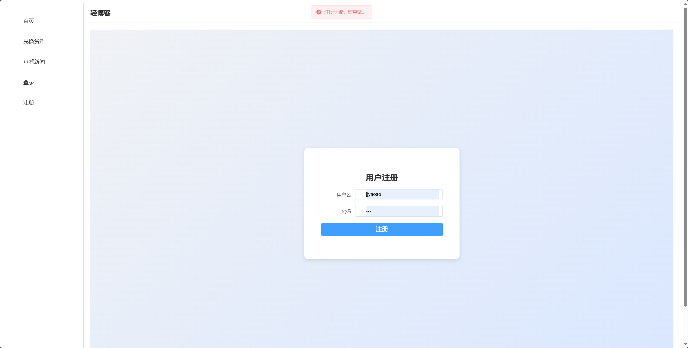

# Simple_blog_system

## 项目简介

Simple_blog_system 是一个基于 Go 和 Vue3 技术栈开发的简单博客系统，旨在提供一个基础的全栈项目示例，展示前后端交互的实现方式。该项目适合作为学习 Go 语言后端开发和 Vue3 前端开发的入门项目。

## 技术栈

- **后端**：Go
- **前端**：Vue3
- **数据库**：MySQL
- **缓存**：Redis

## 快速开始

### 后端部分

1. 进入后端项目目录：

   ```
   cd backend
   ```

2. 安装依赖
   ```
   go get -u github.com/gin-gonic/gin
   go get github.com/spf13/viper
   go get -u gorm.io/gorm
   go get -u golang.org/x/crypto/bcrypt
   go get github.com/golang-jwt/jwt/v5
   go get -u github.com/go-redis/redis
   go get github.com/gin-contrib/cors
   go get github.com/go-redis/redis/v8
   ```
   
3. 运行后端服务：

   ```
   go run .
   ```

### 环境依赖

- 请确保本地已安装并运行 Redis 和 MySQL。
- 配置文件位于 `config` 目录下，请根据需要修改 `yml` 文件中的配置项以匹配您的环境。

### 前端部分

1. 进入前端项目目录：

   ```
   cd frontend
   ```

2. 安装依赖：

   ```
   npm i
   ```

3. 启动前端开发服务器：

   ```
   npm run dev
   ```

## 项目结构

- **backend**：后端代码目录，包含主要的 Go 语言服务逻辑。
- **frontend**：前端代码目录，使用 Vue3 实现用户界面和与后端的交互。
- **config**：后端的配置文件目录，包含 Redis 和 MySQL 的相关设置。

## 注意事项

- 请确保在启动项目之前，本地 Redis 和 MySQL 服务已启动并可访问。
- 项目的配置文件 `config.yml` 需要根据实际开发环境进行调整，确保数据库连接和 Redis 配置正确。


如有问题或建议，欢迎通过项目的 issue 页面进行反馈。

## 效果展示


> 登录注册




> 登录后


